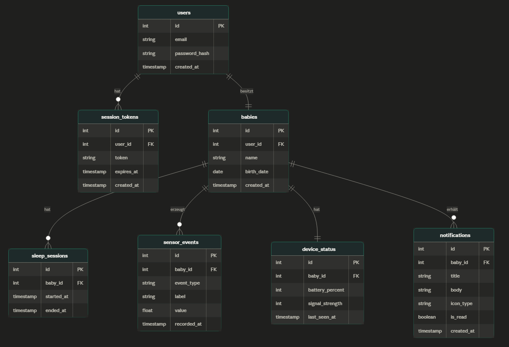

# GuetNacht

## Kurzbeschreibung des Projekts

* **Modul:** Interaktive Medien 4 an der Fachhochschule Graubünden (FS26)
* **Themenfeld:** IoT-Applikation zum Thema Eltern mit kleinen Kindern
* **Name des Projekts:** GuetNacht
* **Team Physical Computing:** Ali Tas, Naim El Amri Fernandez
* **Team WebApp:** Berhan Can Soeyler, Domenico Winkelmann

Eltern von Kleinkindern müssen nachts regelmässig aufstehen, um zu prüfen, ob ihr Kind schläft – das unterbricht den eigenen Schlaf unnötig. **GuetNacht** löst dieses Problem: Ein Sensor im Kinderzimmer erfasst Bewegungen des Kindes und sendet die Daten in Echtzeit an eine Web-App. Eltern können jederzeit auf ihrem Handy prüfen, ob ihr Kind schläft – ohne aufzustehen. Zusätzlich werden Schlafverläufe über die Nacht hinweg aufgezeichnet, sodass Eltern Muster erkennen und den Schlaf ihrer Kinder besser verstehen können.

> Ziel: Mehr Schlaf für Eltern, mehr Sicherheit fürs Kind – mit einem Blick aufs Handy.

---

### UX & Konzeption

* **Figma Prototype:** [Link zum Figma](https://swab-petal-26919808.figma.site/login)
* **User Flow + Screen Flow:** [Figma Board](https://www.figma.com/board/huYgRhEg2Ajw7vPQa6zClf/IM4---User-Flow?node-id=0-1&t=tmeUp1Ry2uoL12Zv-0)

**Angedachte Features:**
* Live-Ansicht ob das Kind schläft (Echtzeit-Status)
* Schlaf-History über die Nacht (Verlauf und Statistiken)
* Alarmierung mit Ton bei Bewegung / Aufwachen

**Nicht umgesetzte Features:**
* **Alarmierung mit Ton** – zu aufwändig, keine Zeit mehr bis zur Abgabe. Das Feature ist konzeptionell vollständig geplant und könnte in einem nächsten Entwicklungsschritt ergänzt werden.

---

### Setup

* **WebApp:** [https://im4.domenicowinkelmann.ch/](https://im4.domenicowinkelmann.ch/)
* **Video-Dokumentation:** 

---

#### Installationsanleitung WebApp

**1. Benötigte Infrastruktur**

* Webserver mit PHP 8.0+ (z.B. Infomaniak, XAMPP lokal)
* MySQL-Datenbank
* PHP-Erweiterungen: `pdo`, `pdo_mysql`, `json`

**2. Repository klonen**

```bash
git clone https://github.com/domenicowinkelmann/im4-guetnacht.git
cd im4-guetnacht
```

**3. Datenbank einrichten**

Führe die beiden SQL-Dateien in phpMyAdmin (oder einem anderen MySQL-Client) aus – in dieser Reihenfolge:

```
database/01_schema.sql       ← erstellt alle Tabellen
database/02_dummy_data.sql   ← fügt Testdaten ein (Demo-Login: demo@schlafwaechter.ch / demo1234)
```

**4. Datenbank-Credentials eintragen**

Erstelle die Datei `backend/config/config.secure.php` (nicht im Repository enthalten – aus Sicherheitsgründen in `.gitignore`):

```php
<?php
define('DB_HOST', 'dein-datenbankserver');
define('DB_PORT', 3306);
define('DB_NAME', 'dein_datenbankname');
define('DB_USER', 'dein_benutzer');
define('DB_PASS', 'dein_passwort');
define('TOKEN_SECRET', 'dein-64-zeichen-hex-string');
```

`backend/config/config.public.php` enthält alle nicht-sensitiven Einstellungen (Token-Gültigkeitsdauer etc.) und ist committet.

**5. Webserver konfigurieren**

Stelle sicher, dass der Document-Root auf das Projektverzeichnis zeigt. `index.html` liegt im Root, das Backend unter `/backend/api/`.

**6. Physisches Artefakt in Betrieb nehmen**

Siehe Bauanleitung Physical Computing unten. Der Sensor sendet per HTTP POST an:

```
POST https://deine-domain.ch/backend/api/sensor/ingest.php
Content-Type: application/json

{ "baby_id": 1, "bewegung": 1 }
```

Die `baby_id` erhältst du nach dem ersten Login und der Registrierung des Babys in der App (oder via `SELECT id, name FROM babies;` in phpMyAdmin).

---

#### Bauanleitung Physical Computing


---

## Technische Details

### Projektstruktur / Code-Struktur

```
/                          ← Web-Root
├── index.html             ← Single Page App (alle Seiten via JS eingeblendet)
├── styles.css             ← Globales Styling
├── nightmode.css          ← Dark Mode Styles
├── favicon.ico
├── js/
│   ├── api.js             ← API-Kommunikation, Auth-Klasse, Token-Verwaltung
│   └── script.js          ← App-State, Navigation, UI-Logik
└── backend/
    ├── config/
    │   ├── config.public.php      ← Öffentliche Konfiguration (committet)
    │   ├── config.secure.php      ← Secrets & DB-Credentials (in .gitignore)
    │   └── database.php           ← PDO-Verbindung
    ├── middleware/
    │   └── auth.php               ← Token-Validierung (requireAuth())
    ├── models/
    │   ├── UserModel.php          ← SQL für User-Operationen
    │   └── SleepModel.php         ← SQL für Schlaf-/Sensordaten
    ├── utils/
    │   └── bootstrap.php          ← CORS, JSON-Header, Hilfsfunktionen
    └── api/
        ├── auth/
        │   ├── login.php
        │   ├── logout.php
        │   └── register.php
        ├── sensor/
        │   └── ingest.php         ← Endpunkt für den ESP32
        ├── baby.php
        ├── dashboard.php
        ├── live.php
        └── notifications.php
```

**Datenfluss:**

```
ESP32 Sensor
    │  POST bewegung=0/1
    ▼
ingest.php  →  sensor_events  →  live.php      →  Frontend (Live-Seite)
            →  sleep_sessions →  dashboard.php →  Frontend (Dashboard)
            →  notifications  →  notifications.php
            →  device_status  →  live.php (Batterie, Verbindung)
```

Jeder API-Endpunkt folgt dem **ETL-Muster**: Extract (SQL via Model), Transform (Berechnungen, Labels, Zeitangaben), Load (sauberes JSON).

### Datenschnittstelle (WebApp ↔ Physical Computing)

Der ESP32 kommuniziert ausschliesslich über einen einzigen HTTP POST-Endpunkt:

```
POST /backend/api/sensor/ingest.php
{ "baby_id": 1, "bewegung": 1, "battery": 87, "signal": 4 }
```

| Feld | Typ | Beschreibung |
|---|---|---|
| `baby_id` | int | ID des Babys in der Datenbank (hardcoded im Sensor) |
| `bewegung` | int | `1` = Bewegung erkannt, `0` = keine Bewegung (schläft) |
| `battery` | int | Batteriestand in % (optional) |
| `signal` | int | WLAN-Signalstärke 1–5 (optional) |

`ingest.php` übernimmt die gesamte Logik: Schlaf-Sessions öffnen/schliessen, Events schreiben, Notifications erstellen.

### ERM (Entity Relationship Model)



Die Datenbank enthält folgende Tabellen:

| Tabelle | Beschreibung |
|---|---|
| `users` | App-Benutzer (E-Mail, Passwort-Hash) |
| `session_tokens` | Auth-Tokens mit Ablaufdatum (7 Tage) |
| `babies` | Babyprofil (Name, Geburtsdatum, verknüpft mit User) |
| `sleep_sessions` | Schlafphasen (started_at / ended_at) |
| `sensor_events` | Einzelne Ereignisse (Bewegung, Schlafen, Aufgewacht) |
| `device_status` | Letzter bekannter Sensor-Zustand (Batterie, Signal) |
| `notifications` | Benachrichtigungen für den User |

### Authentifizierung

Die App verwendet **HMAC-signierte Bearer Tokens**:

1. Bei Login/Registrierung erstellt `login.php` / `register.php` einen Token bestehend aus Payload (user_id, Ablaufdatum) + HMAC-Signatur (signiert mit `TOKEN_SECRET`).
2. Der Token wird in `session_tokens` gespeichert und ans Frontend zurückgegeben.
3. Das Frontend speichert ihn in `localStorage` und sendet ihn bei jedem API-Request als `Authorization: Bearer <token>`.
4. `auth.php` (`requireAuth()`) validiert Signatur und Ablaufdatum – ein ungültiger oder abgelaufener Token gibt `401` zurück.
5. Bei `401` leitet das Frontend automatisch zur Login-Seite weiter.
6. Token-Gültigkeitsdauer: 7 Tage (konfigurierbar in `config.public.php`).

---

## Known Bugs

* **Push-Benachrichtigungen (Ton/Push):** Nicht implementiert – das Backend und die UI sind vorbereitet (Toggle in Einstellungen), aber die eigentliche Browser-Push-Benachrichtigung wurde nicht fertiggestellt.

---

## Umsetzungsprozess

**Reflexion / Erfahrung / Lernfortschritt:**
Das Projekt lief insgesamt sehr gut. Auf der WebApp-Seite konnte das Team die Kenntnisse in Tailwind CSS vertiefen und ein vollständiges PHP-Backend mit sauberer Schichtenarchitektur (Config, Models, Middleware, API) aufbauen. Rückblickend würde das Team die Zeitplanung besser aufteilen, um auch kleinere Features wie die Ton-Benachrichtigung noch umsetzen zu können.

**Herausforderungen & Lösungen:**
* **Ton-Benachrichtigungen:** Wurden konzeptionell geplant und technisch angedacht, aber wegen Zeitmangels/Aufwendigkeit nicht implementiert. Versuche mit der Browser Notifications API zeigten erste Resultate, funktionierten aber nicht zuverlässig genug – daher wurde das Feature fallen gelassen.
* **Sensor-Integration:** Die Schnittstelle zwischen ESP32 und Backend musste so einfach wie möglich gehalten werden. Die Lösung (ein einziger POST-Endpunkt, baby_id hardcoded im Sensor) hat sich als pragmatisch und robust erwiesen.
* **Datenbank-Setup:** Kleinere SQL-Kompatibilitätsprobleme (z.B. `INTERVAL`-Syntax zwischen MySQL und PostgreSQL) mussten gelöst werden.

**KI-Einsatz:**
* **Claude:** Hauptsächlich für die Entwicklung des PHP-Backends, den initialen Aufbau der App-Architektur, das Schlaf-Verlaufsdiagramm auf der Dashboard-Seite, Erstellung der SQL-Skripte für die Dummydaten sowie Code-Dokumentation. Auch für die Implementierung des Night Mode verwendet.
* KI wurde als Werkzeug eingesetzt, alle Entscheidungen zu Struktur und Design wurden vom Team getroffen und nachvollzogen.

**Fazit:**
GuetNacht ist ein funktionierendes IoT-System, das den Alltag von Eltern mit Kleinkindern vereinfacht. Die Zusammenarbeit zwischen Physical-Computing- und WebApp-Team über eine klar definierte Sensor-Schnittstelle hat gut funktioniert. Das Projekt zeigt, wie ein ESP32-Sensor, eine PHP-API und eine mobile Web-App zu einem kohärenten Produkt zusammenwachsen können.